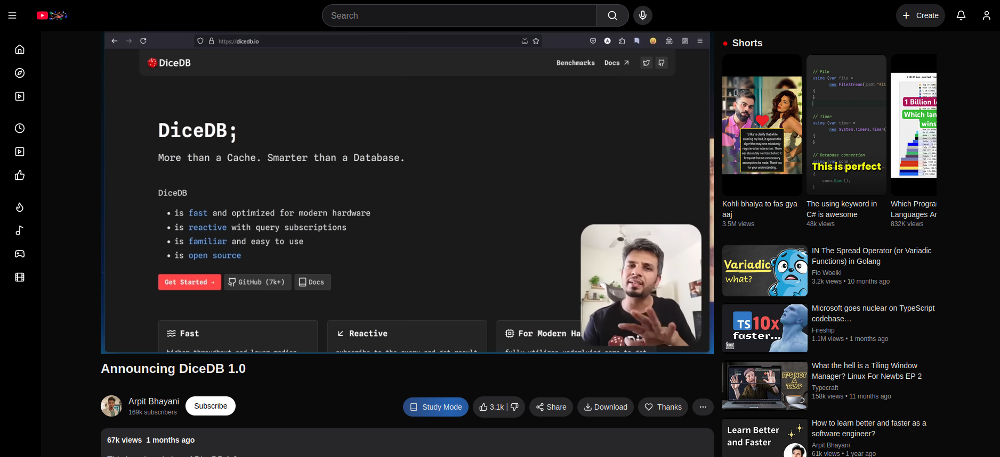
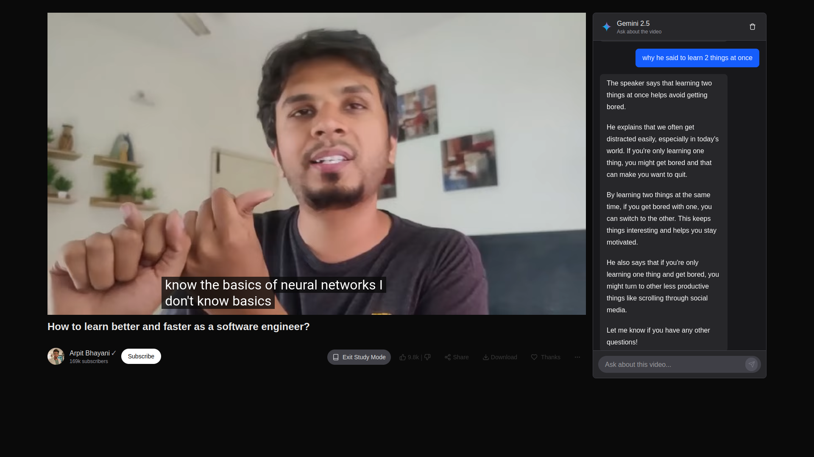
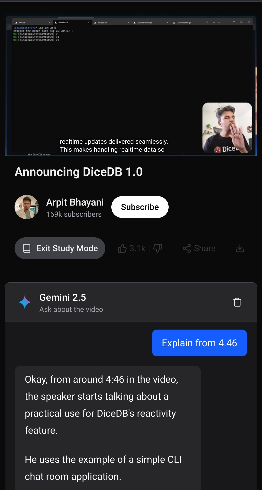

# StudyTube: AI-Enhanced YouTube Learning Experience




## 🏆 Level Up Vibe Coding Hackathon - Outlier AI

This project was created for the **Level Up Vibe Coding Hackathon** hosted by Outlier AI. StudyTube transforms the way users interact with educational YouTube content by adding an AI-powered study mode that helps users better understand and engage with video content.

## 📝 Project Overview

StudyTube is a Next.js application that enhances the YouTube viewing experience by adding a dedicated "Study Mode" feature. When activated, this mode provides an AI assistant that can answer questions about the video content, explain concepts, and help users better understand the material being presented.

### New Features Added

- **Distraction-Free Study Mode**: Eliminates shorts, suggested videos, comments, and other distracting elements that typically pull students away from educational content
- **AI-Powered Learning Assistant**: Integrated Gemini 2.5 model that analyzes video transcripts to answer specific questions about the content, explain concepts, and enhance understanding
- **Video Transcript Analysis**: The AI assistant uses the video transcript to provide accurate, contextual responses to student questions
- **Focused Learning Environment**: Clean UI that prioritizes content consumption and comprehension over engagement metrics
- **Responsive Design**: Works seamlessly across desktop and mobile devices

---



---

## 🚀 Getting Started

### Prerequisites

- Node.js 18+ or Bun
- API key for the AI service (configured in .env file)

### Installation

1. Clone the repository:
   ```bash
   git clone https://github.com/biisal/studytube.git
   cd studytube
   ```

2. Install dependencies:
   ```bash
   npm install
   # or
   yarn
   # or
   bun install
   ```

3. Create a `.env` file in the root directory and add this free API key:
   ```
   NEXT_PUBLIC_API_BASE_URL=https://api.codeltix.com/api/v1
   ```

4. Start the development server:
   ```bash
   npm run dev
   # or
   yarn dev
   # or
   bun dev
   ```

5. Open [http://localhost:3000](http://localhost:3000) with your browser to see the application.

## 🧠 How Study Mode Works

### The Problem: Distractions in Educational Content

Students often struggle to focus on educational content on YouTube due to:
- Distracting shorts that pull attention away from the main content
- Endless suggested videos that encourage continuous browsing
- Comment sections that can be time-consuming and off-topic
- UI elements designed to maximize engagement rather than learning



### Our Solution: Distraction-Free Study Mode

1. Browse the video catalog and select an educational video to watch
2. Click the "Study Mode" button to activate the distraction-free environment
3. All distracting elements are immediately removed from the interface:
   - Shorts section is hidden
   - Suggested videos are removed
   - Comments section is hidden
   - Social engagement buttons are de-emphasized
4. The Gemini 2.5 AI assistant becomes available in a dedicated chat panel
5. Ask specific questions about the video content in the chat panel
6. The AI analyzes the video transcript and provides contextual, educational responses

The AI assistant is context-aware and specifically trained to understand the content of the current video, making it an effective study companion. By removing distractions and providing intelligent assistance, StudyTube creates an environment where students can focus entirely on learning.

## 💻 Technology Stack

- **Frontend**: Next.js 15, React 19, TailwindCSS 4
- **State Management**: Zustand
- **AI Integration**: Custom API integration with Gemini 2.5 model
- **Styling**: TailwindCSS with custom components
- **Markdown Rendering**: React Markdown for formatted AI responses

## 🔧 Project Structure

- `/app`: Main application pages and layouts
- `/components`: Reusable UI components
- `/hooks`: Custom React hooks including Zustand stores
- `/context`: React context providers
- `/public`: Static assets
- `/dummy.ts`: Sample video data with transcripts (for demo purposes)

## 🎯 Hackathon Focus

For the Level Up Vibe Coding Hackathon, i focused on:

1. Creating an intuitive, familiar interface that reduces the learning curve
2. Developing a powerful AI integration that enhances the educational experience
3. Ensuring the application is responsive and accessible across devices
4. Implementing a clean, modern UI that promotes focus and learning

## 📄 License

This project is licensed under the MIT License - see the LICENSE file for details.

## 🙏 Acknowledgements

- Outlier AI for hosting the Level Up Vibe Coding Hackathon
- The Next.js team for their excellent framework
- All contributors who helped build this project

---

Built with ❤️ for the Level Up Vibe Coding Hackathon
